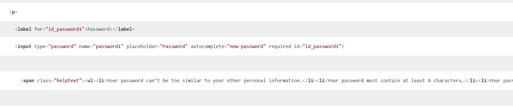

# QuoteSmart
QuoteSmart is designed for literary quotes aficionados. No more searching for that one quote among piles of notes and random books. With QuoteSmart you can store all your favourite quotes in one place and access them at a click of a button.

[Live Website](https://quotesmart-project-b900b8055e93.herokuapp.com/)

## User Goals and Stories

### Unregistered user goals
- As a unregistered user I want to:
  - be able to immediately understand the purpose of the website
  - easily and intuitively navigate throughout the website
  - be able to view the website and read all information on all screen sizes
  - register on the website
 
### Registered user goals
- As a registered user I want to: 
  - sign in 
  - read quotes added by me and other users
  - add quotes
  - edit and delete quotes that I have added
  - log out

### User Stories

#### As a user
  - As a user I want to visit the website and understand it’s purpose immediately
  - As a user I want to navigate the page intuitively and with ease
  - As a user I want to create an account easily
  - As a user I want to input my information with ease
  - As a user I want to be able to read, add, edit and delete quotes

## Design

The visual aspects of the website were carefully chosen to convey the atmosphere of an old library with it's bookish vibe while at the same time remaining modern and minimalistic.

### Font
I used fonts from GoogleFonts. I have chosen Montserrat for it's clean, elegant look and Special Elite for the resemblance to traditional typewriter print to stand out on the background of old yellowed paper. 

### Colour

The colour scheme is simple, consisting 3 earthy tones complementing hero image.

### Logo

I have created the logo in [Canva](www.canva.com) to match the mood of the website.

### Wireframes

  - Homepage/s
  

  - Quotes
  
  
  - Detailed Quotes
  

### Model

  

## Development

### Agile Methodology

This project was developed using the Agile methodology. 

This project had milestones: 

- Planning

- Initial set up
    
- Authorization

- CRUD

- Visuals

- Deployment

- Documentation

## Technologies used

- Python
- HTML
- CSS
- GitHub
- VSCode
- Git
- Heroku
- PostgreSql
  
- Pixabay
- Picflow.com
- Favicon.io
- Font Awesome 
- Bootstrap5
- Google Fonts
 
- CI Python Linter Validator
- Rocketvalidator
- Jigsaw CSS Validator
- Chrome Dev Tools
- Balsamiq
- Canva

## Features 

### Existing Features

__Home__
- This is the first page that the user will see when they arrive on the website. 
- It is meant to convey the purpose of the website. 
- It has two versions depending on user being logged in. 
- Unregistered user is encouraged to registered and logged in user is greeted by the username and encouraged to browse or add quotes.

  
  

__Quotes__
- Displays a list of four quotes.
- Users can move back and forth between the lists of quotes using buttons on the bottom of the page.
- There is a button under each quote which gives user access to details of the quote.

  

__Quotes Details__
- Chosen quote is prominently displayed with info about he author an the source below.
- If the quote was added by the same user they have access to option of editing or deleting the quote.

  
  

__Add Quote__
- Form allowing user to add new quote to the database.

  

__Edit Quote__
- Prepopulated form to edit the quote.

  
 
__Delete Quote__
- User is asked to confirm their decision to delete the quote.

  
  
__Navigation__
- Every page contains the navbar.
- Unregistered user navbar contains links to home, register, log in.
- Logged in user has access to the following links: home, quotes, add quote, log out.

__Footer__
 - In keeping with the minimal and clean look of the website the footer only contains three icons to social media which lead to 

__Register Page__
- If users do not have an account they will be brought to a sign up page where they can create an account.
 

__Log In Page__
- Registered users can log in to their acounts.
- If unregistered users attempt to access page for registered users through url they will be redirected to Log In page. 

__Log out page__
- Registered user can log out.
 

__Page 404__
 

### Accesibility

I received the following scores on my lighthouse testing

### Features Left to Implement

- I wanted to add a searchbar on the right side of the navbar.

- Displaying quotes in assigned categories.

- My Favourite Quotes page for every user. 

- Utilizing better admin's option to verify quotes. Possibly display quote with a note that it is not verified yet. 

## Testing 

### BUGS

 - I encountered several bugs while creating this project.

- Bootstrap navbar went through many stages of not working on smaller devices. From being permanently closed to being permanently open. I run out of time to sort the problem and currently on the mobile phone screens hamburger icon sits beside the permanently open navigation menu.

- I also had an issue with Bootstrap Logo inside the navbar not being responsive and covering most of the navbar on smaller screens. I have tested many solutions but finally solved it by adding "style=max-width:30vw" directly to the logo.

- I had several issues with static being disconnected after collectstatic command. It turned out to be a combination of website loading from cache and incorrect url pattern.

- Early on I had issues with virtual environment but managed to solve them with the help of the youtube tutorial - details in credits.

### User Testing

The application was tested on HP Pavilion using Firefox and Google Chrome browser.

I also tested it on the following mobile devices:
  Galaxy S21 Ultra
  Oppo Reno 2
All worked as planned with the exception of the Bootstrap navbar - as described in detail in Bugs section.
 
I also utilised Google Chrome Dev tools to test it on an Ipad and it was working correctly.

### Validator Testing 

- Python passed through Code Institute Linter without issues:

- CSS validated with  Jigsaw CSS Validator:

  

- HTML validated with Rocketvalidator - it was more convenient to use than the W3C one due to the inclusions of Java Script among HTML.
It returned 4 errors and 4 warnings. All warnings were related to "possible misuse of aria-label in the context of paper texture background.
All 4 errors were caused by the code on Allauth pages.

### Manual Testing

- ensured the app loads on all browsers
- ensured the elements (such as buttons, forms, and menu) are visible
- tested the clickable elements on the app page
- ensured the page content is visible on all devices

Manually tested across several devices:
- the links
- the buttons
- signup, sign in, login and functionality
- CRUD functionality
- verify fields and their inputs

Tests were concluded with positive results other than a toggle malfunction on small screen devices mentioned earlier.

- Negative test was performed in a scenario where unregistered user was attempting to by pass login by typing url directly into the browser.
User was diverted to sign in page as expected.

### Unfixed Bugs
 - Toggle is not working correctly on mobile phone screens.

## Deployment

I created a separate file to outline the deployment process as it was too long to detail all of the steps here

- The site was deployed to GitHub pages. The steps to deploy are as follows: 
  - In the GitHub repository, navigate to the Settings tab 
  - From the source section drop-down menu, select the Main Branch
  - Once the main branch has been selected, the page will be automatically refreshed.. 

- Clone the Repository Code Locally
  - Navigate to the GitHub Repository you want to clone to use locally:

  - Click on the code drop down button
  - Click on HTTPS
  - Copy the repository link to the clipboard
  - Open your IDE of choice (git must be installed for the next steps)
  - Type git clone copied-git-url into the IDE terminal
  - The project will now of been cloned on your local machine for use.

- Fork the repository
  - For creating a copy of the repository on your account and change it without affecting the original project, useFork directly from GitHub:

  - On My Repository Page, press Fork in the top right of the page
  - A forked version of my project will appear in your repository

- Heroku 
  - The project was deployed to Heroku following instructions from Code Institute Django Walkthrough tutorial.

## Credits 

### Content 

- The format and template for the README file was borrowed from the [Code institute](https://codeinstitute.net/ie/)

- The images were taken from [Pixabay](https://www.pixabay.com/) 

- The image conversions from png to webp were done with [Picflow](https://picflow.com)

- The code for the navbar was taken from [Bootstrap](https://getbootstrap.com/docs/5.0/components/navbar/)

- [Code Institute Django walkthrough](https://learn.codeinstitute.net/) served as a point of inspiration and reference and helped me on many occasion 

- Invaluable help with virtual environment and Django by [Dee Mac](https://www.youtube.com/@IonaFrisbee)

- Issues with [Bootstrap Navbar](https://www.youtube.com/@ByteGrad)

- [Avoiding overcomplicating things](https://www.youtube.com/@Codemycom)

- [Use of login required on class based views](https://stackoverflow.com/questions/6069070/how-to-use-permission-required-decorators-on-django-class-based-views)

- I was referring a lot to Django Documentation (https://docs.djangoproject.com/en/5.1/releases/4.2/), StackOverflow (https://stackoverflow.com/), W3Schools (https://www.w3schools.com/) 

and [Visual Studio Docks](https://code.visualstudio.com/docs)
